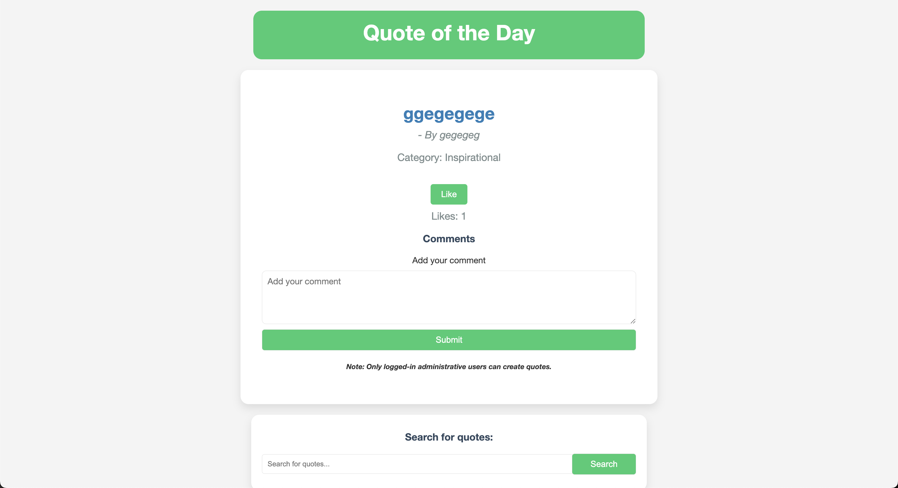
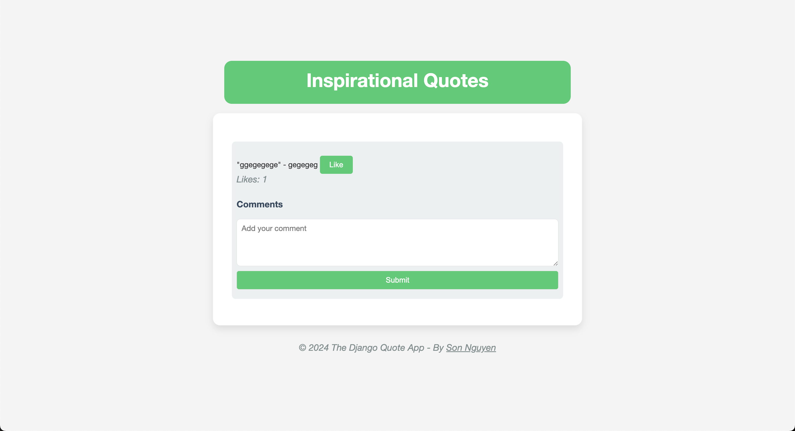
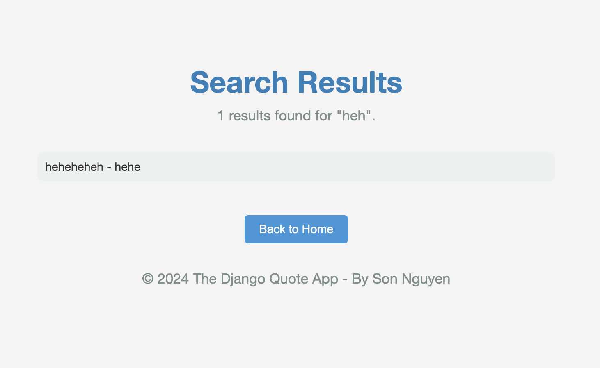
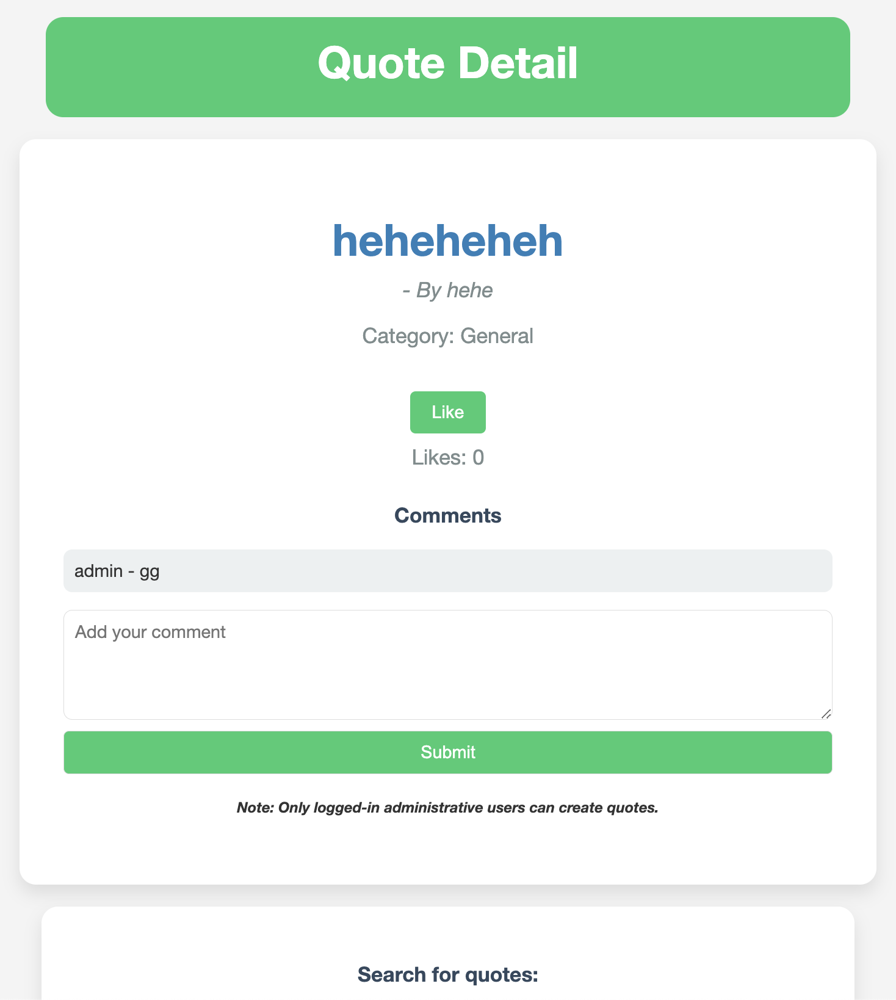
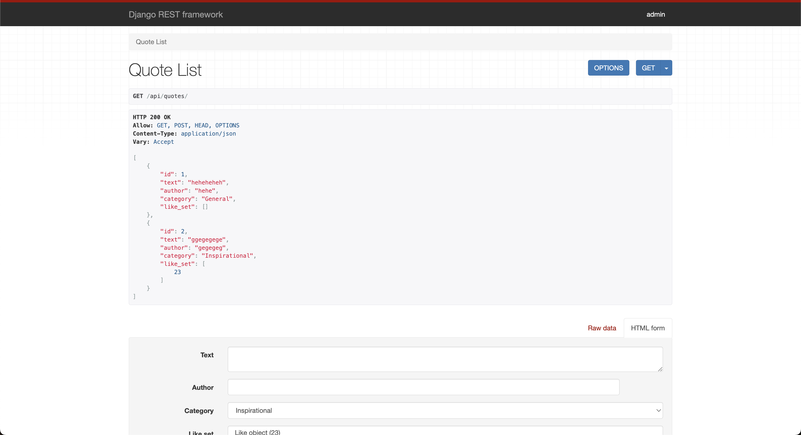

# The Django Quotes App

This is a Django-powered web application that displays inspirational quotes, allows users to like, comment, and search for quotes. It includes a user interface for viewing quotes, an admin interface for managing quotes, and a REST API using Django REST Framework for interacting with quotes programmatically.

## Table of Contents
- [User Interface](#user-interface)
- [Features](#features)
- [Project Structure](#project-structure)
- [How to Run Locally](#how-to-run-locally)
- [User Guide](#user-guide)
- [REST API Usage](#rest-api-usage)
- [Contributing](#contributing)
- [License](#license)
- [Contact](#contact)

## User Interface

### Homepage

<p align="center" style="cursor: pointer">
    
</p>

### Category Page

<p align="center" style="cursor: pointer">
    
</p>

### Search Results

<p align="center" style="cursor: pointer">
    
</p>

### Quote Details

<p align="center" style="cursor: pointer">
    
</p>

## Features

*   **Quote of the Day:** A random quote is displayed on the homepage.
*   **Liking and Commenting:** Authenticated users can like and comment on quotes.
*   **Category Filtering:** Filter quotes by category.
*   **Search:** Easily search for quotes by keywords.
*   **Responsive Design:** Looks great on desktops, tablets, and mobile devices.
*   **Admin Interface:** Add, update, and delete quotes using our admin interface.
*   **REST API:** Interact with quotes programmatically using our API endpoints.

**Note:** Only authenticated users can like and comment on quotes. You can create a superuser account using the Django admin interface or use the admin interface to create user accounts to test these features.

## Project Structure

The project consists of the following main components:

- **`quotes/`:**
    - `models.py`: Contains the database models for quotes and categories.
    - `views.py`: Defines the views for rendering different pages.
    - `urls.py`: Maps URLs to views.
    - `templates/quotes/`: Contains HTML templates for rendering pages.
      - `category.html`: Displays quotes in a specific category.
      - `quote-detail.html`: Shows the details of a quote.
      - `index.html`: The main homepage with the quote of the day.
      - `search.html`: Displays search results.
    - `static/images/`: Contains images used in the project.
    - `__init__.py`: Makes the directory a Python package.
    - `admin.py`: Registers models for the admin interface.
    - `apps.py`: Configuration for the quotes app.
    - `tests.py`: Contains test cases for the application.
    - `urls.py`: URL patterns for the quotes app.
    - `serializers.py`: Serializers for converting model instances to JSON.
- **`QuotesApp/`:**
    - `settings.py`: Contains the project settings and configurations.
    - `urls.py`: Defines the URL patterns for the entire project.
    - `wsgi.py`: WSGI configuration for deployment.
    - `asgi.py`: ASGI configuration for deployment.
    - `__init__.py`: Makes the directory a Python package.
- **`db.sqlite3`:** The default SQLite database file.
- **`manage.py`:** A command-line utility for interacting with the project.

## How to Run Locally

### Prerequisites

*   Python (3.7+)
*   Django (4.x)
*   Django REST Framework
*   Virtual Python Environment (recommended)
*   Git

### Steps

1.  **Clone the repository:** Clone the repository using the Code button in the repository's main GitHub page.

2.  **Create a virtual environment (optional):**

    ```bash
    python -m venv venv
    source venv/bin/activate  # On Windows, use `venv\Scripts\activate`
    ```

3. **Apply migrations:**

    ```bash
    python manage.py makemigrations
    python manage.py migrate
    ```

4. **Create a superuser (for admin access):**

    ```bash
    python manage.py createsuperuser
    ```

5. **Start the development server:**

    ```bash
    # Run the server
    python manage.py runserver
    # Go to the admin interface (http://127.0.0.1:8000/admin/)
    # Create quotes and add them to different categories
    # Go to the homepage to see the quotes (http://127.0.0.1:8000/)
    ```
   
**Important**: Remember to change the Django production secret key and set `DEBUG` to `True` in `QuotesApp/settings.py` order to run the server:
```python
SECRET_KEY = 'your_secret_key'

DEBUG = True
```

## User Guide

### Homepage:

*   The main page displays a random quote of the day.
*   Like and comment on the quote if you're logged in.
*   Use the search bar to find specific quotes.
*   Use the category filter to see quotes in a specific category.

### Searching:

*   Enter your search query in the search bar.
*   The results page will show all quotes containing your keywords.
*   Click on a quote to view its details and comments.

### Categories:

*   Choose a category from the dropdown on the main page.
*   You'll see a list of quotes that belong to that category.

### Liking and Commenting:

*   If you like a quote, click the "Like" button. You can unlike it by clicking again.
*   To comment, type your comment in the text area and click "Submit."

### Adding Quotes (Admin):

*   Go to the admin interface (http://127.0.0.1.8000/admin/).
*   Log in with the superuser credentials you created earlier.
*   Click on "Quotes" and then "Add Quote."
*   Fill in the quote text, author, and category.
*   Click "Save" to add the quote to the database.

## REST API Usage

The app also includes a REST API built with Django REST Framework. Here are some of the available endpoints:

| Endpoint                           | Method | Description                        | Authentication Required |
|:-----------------------------------|:------:|:-----------------------------------|:-----------------------:|
| `/api/quotes/`                     |  GET   | Get a list of all quotes.          |           No            |
| `/api/quotes/<id>/`                |  GET   | Get a specific quote by ID.        |           No            |
| `/api/quotes/`                     |  POST  | Create a new quote.                |           Yes           |
| `/api/quotes/<id>/`                |  PUT   | Update a specific quote.           |           Yes           |
| `/api/quotes/<id>/`                | DELETE | Delete a specific quote.           |           Yes           |
| `/api/quotes/<quote_id>/comments/` |  GET   | Get comments for a specific quote. |           No            |
| `/api/quotes/<quote_id>/comments/` |  POST  | Add a comment to a specific quote. |           Yes           |

**Example Usage (with curl):**

```bash
# Get all quotes
curl http://127.0.0.1:8000/api/quotes/

# Get a specific quote
curl http://127.0.0.1:8000/api/quotes/1/
```

For example, running `curl http://127.0.0.1:800/api/quotes/` will return this output:

```json
[{"id":1,"text":"heheheheh","author":"hehe","category":"General","like_set":[]},{"id":2,"text":"ggegegege","author":"gegegeg","category":"Inspirational","like_set":[23]}]       
```

You can also go to the API endpoints directly in your browser to see the JSON responses, such as:

<p align="center" style="cursor: pointer">
    
</p>

**Authentication:**

For endpoints that require authentication, you'll need to include an authorization token (e.g., JWT) in the request headers. You can obtain this token by implementing a login/authentication system in your Django app.

**API Development:**

To get started on developing and customizing this app's APIs, follow these steps:

```bash
pip install djangorestframework
```

Then, Add DRF to `INSTALLED_APPS` in `settings.py`:

```python
# settings.py
INSTALLED_APPS = [
    # ... existing apps
    'rest_framework',
]
```

## Contributing

If you'd like to contribute to this project, please fork the repository and submit a pull request.

## License

This project is licensed under the MIT License. See the [LICENSE](LICENSE) file for details.

## Contact

If you have any questions about the project or Django (or even the Django REST Framework) in general, feel free to [contact me](mailto:info@movie-verse.com)! I'll be happy to answer any questions you might have (hopefully I'll know the answers to them...)

---

Thank you for visiting!
